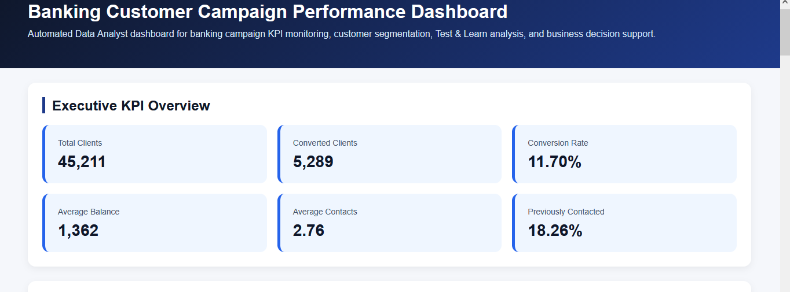
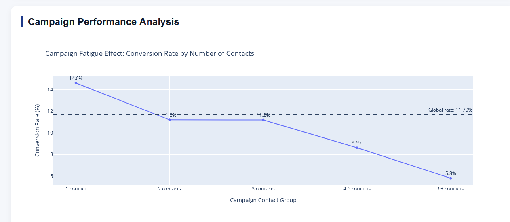
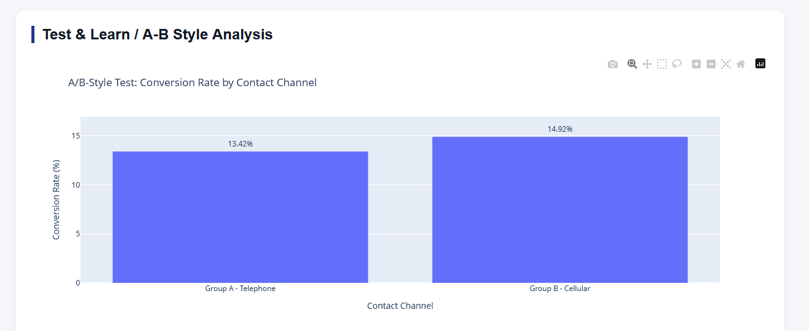
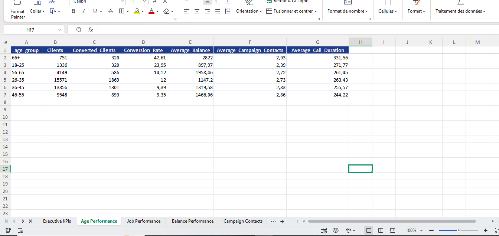

# Banking Customer Campaign Performance Analytics

## Project Overview

This project is an end-to-end Data Analyst project focused on banking customer campaign performance analysis.

The objective is to analyze a retail banking marketing campaign dataset in order to monitor business KPIs, identify high-performing customer segments, evaluate campaign efficiency, simulate a Test & Learn / A-B style analysis, and generate automated reporting outputs.

This project is aligned with Data Analyst roles in banking, financial services, insurance, consulting, and business performance teams.

---

## Business Context

Banks need to improve the efficiency of their customer campaigns by targeting the right clients, reducing unnecessary contacts, and monitoring key performance indicators.

This project supports business decision-making through:

- customer data cleaning and structuring;
- KPI definition;
- customer segmentation;
- campaign performance analysis;
- Test & Learn / A-B style analysis;
- automated HTML dashboard;
- automated Excel KPI report;
- executive business recommendations.

---

## Dataset

The project uses the Bank Marketing dataset.

The dataset contains customer information, campaign contact history, financial attributes, and the final campaign outcome.

The target variable is:

- `yes`: the client accepted the banking offer;
- `no`: the client did not accept the banking offer.

Dataset size:

- 45,211 observations;
- 17 original variables;
- 0 missing values;
- 0 duplicated rows.

The target variable is naturally imbalanced, with a global conversion rate of 11.70%. Since this project is focused on business analytics and campaign performance monitoring rather than predictive modeling, the original distribution is preserved to reflect the real campaign performance.

---

## Project Objectives

The main objectives of this project are:

1. Analyze the global campaign conversion performance.
2. Define relevant banking KPIs.
3. Identify customer segments with high conversion potential.
4. Evaluate campaign contact efficiency.
5. Detect campaign fatigue effects.
6. Compare contact channels using an A-B style Test & Learn approach.
7. Generate an automated HTML dashboard.
8. Generate an automated Excel KPI report.
9. Provide actionable business recommendations.

---

## Key Business KPIs

| KPI | Value |
|---|---:|
| Total Clients | 45,211 |
| Converted Clients | 5,289 |
| Not Converted Clients | 39,922 |
| Global Conversion Rate | 11.70% |
| Average Balance | 1,362.27 |
| Median Balance | 448 |
| Average Campaign Contacts | 2.76 |
| Previously Contacted Clients | 18.26% |

The global campaign conversion rate is **11.70%**, meaning that approximately 12 out of every 100 contacted clients accepted the banking offer.

---

## Main Business Insights

### 1. Previous Campaign Success Is the Strongest Conversion Driver

Clients with a successful previous campaign outcome achieved a conversion rate of approximately **64.7%**, compared to the global conversion rate of **11.7%**.

This indicates that previous campaign history is one of the strongest indicators for future targeting.

### 2. Campaign Fatigue Effect

The conversion rate decreases as the number of campaign contacts increases:

| Contact Group | Conversion Rate |
|---|---:|
| 1 contact | 14.6% |
| 2 contacts | 11.2% |
| 3 contacts | 11.2% |
| 4-5 contacts | 8.6% |
| 6+ contacts | 5.8% |

This suggests that excessive repeated contacts can reduce campaign effectiveness.

### 3. High-Performing Customer Profiles

The strongest customer profiles include:

- students;
- retired clients;
- clients aged 66+;
- young adults aged 18-25.

These segments show above-average conversion rates and can be prioritized in future campaigns.

### 4. Financial Profile Matters

Clients with stronger account balances convert better than clients with low or negative balances.

| Balance Segment | Conversion Rate |
|---|---:|
| High Balance | 17.11% |
| Premium Balance | 15.50% |
| Medium Balance | 13.02% |
| Low Balance | 10.25% |
| Negative or Zero Balance | 6.90% |

This suggests that balance level is an important commercial targeting indicator.

### 5. Loan Profile Impact

Clients with no active loan show a higher conversion rate than clients with housing loans, personal loans, or both.

This suggests that customers already engaged in credit commitments may be less responsive to new banking offers.

### 6. Campaign Timing

Some months show high conversion rates, especially March, September, October, and December.

However, campaign volume should also be considered before making final planning decisions, because some high-performing months may have fewer contacted clients.

---

## Test & Learn / A-B Style Analysis

A Test & Learn analysis was performed to compare two contact channels:

- Group A: Telephone;
- Group B: Cellular.

| Metric | Telephone | Cellular |
|---|---:|---:|
| Clients | 2,906 | 29,285 |
| Converted Clients | 390 | 4,369 |
| Conversion Rate | 13.42% | 14.92% |

The cellular channel achieved a higher conversion rate than the telephone channel.

The difference is **+1.50 percentage points**, with a p-value of **0.0300**.

Since the p-value is below 0.05, the difference is statistically significant at the 5% level.

However, this analysis is based on historical observational data and not a fully randomized experiment. Therefore, the result should be interpreted as Test & Learn evidence rather than strict causal proof.

---

## Business Recommendations

Based on the analysis, the following actions are recommended:

1. Prioritize clients with previous campaign success.
2. Focus on high-performing segments such as students, retired clients, seniors, and young adults.
3. Target customers with medium, high, and premium account balances.
4. Reduce excessive repeated contacts to avoid campaign fatigue.
5. Prefer cellular contact for future campaigns, while validating the result with a controlled A-B test.
6. Monitor conversion rate by month to improve campaign timing.
7. Build recurring KPI dashboards for marketing and commercial teams.

---

## Deliverables

This project generated the following outputs:

- cleaned analytical dataset;
- business KPI tables;
- customer segmentation analysis;
- campaign performance analysis;
- Test & Learn / A-B style analysis;
- automated HTML dashboard;
- automated Excel KPI report;
- executive business summary;
- saved visualizations.

---

## Project Structure

```text
banking-customer-campaign-performance-analytics/
│
├── dashboard/
│   └── banking_campaign_dashboard.html
│
├── data/
│   ├── raw/
│   └── processed/
│       ├── banking_campaign_processed_initial.csv
│       └── banking_campaign_kpi_enriched.csv
│
├── notebook/
│   └── banking_campaign_analysis.ipynb
│
├── reports/
│   ├── banking_kpi_report.xlsx
│   ├── executive_summary.md
│   ├── global_business_kpis.csv
│   └── figures/
│
├── screenshots/
│   ├── 01_dashboard_kpi_overview.png
│   ├── 02_global_campaign_conversion.png
│   ├── 03_customer_segmentation.png
│   ├── 04_campaign_fatigue.png
│   ├── 05_ab_test_analysis.png
│   └── 06_excel_kpi_report.png
│
├── src/
│
├── README.md
├── requirements.txt
└── .gitignore
```

---

## Screenshots

### Executive KPI Overview



### Global Campaign Conversion


### Customer Segmentation Performance


### Campaign Fatigue Effect



### Test & Learn / A-B Style Analysis



### Automated Excel KPI Report



---

## Automated Dashboard

The project includes an automated HTML dashboard generated with Python and Plotly.

Dashboard file:

```text
dashboard/banking_campaign_dashboard.html
```

The dashboard contains:

- executive KPI cards;
- global campaign conversion;
- customer segmentation performance;
- campaign fatigue analysis;
- previous campaign outcome analysis;
- Test & Learn / A-B style analysis;
- business recommendations.

---

## Automated Excel Report

The project also generates an automated Excel KPI report:

```text
reports/banking_kpi_report.xlsx
```

The Excel report contains multiple sheets:

- Executive KPIs;
- Age Performance;
- Job Performance;
- Balance Performance;
- Campaign Contacts;
- Previous Outcome;
- Loan Profile;
- Month Performance;
- AB Test Summary;
- AB Test Stats;
- Recommendations.

---

## Executive Summary

An executive business summary is also generated automatically:

```text
reports/executive_summary.md
```

It summarizes:

- project objective;
- global campaign KPIs;
- key business insights;
- Test & Learn results;
- business recommendations;
- final deliverables.

---

## Methodology

The project follows a structured Data Analyst workflow:

1. Project setup and library import.
2. Data loading and initial understanding.
3. Data quality assessment.
4. KPI feature engineering.
5. Exploratory data analysis.
6. Customer segmentation analysis.
7. Campaign performance analysis.
8. Test & Learn / A-B style analysis.
9. Automated HTML dashboard generation.
10. Automated Excel KPI report generation.
11. Executive summary generation.

---

## Technologies Used

- Python
- Pandas
- NumPy
- Matplotlib
- Seaborn
- Plotly
- OpenPyXL
- SciPy
- Jupyter Notebook
- Excel reporting
- HTML dashboarding

---

## Role Alignment

This project is aligned with Data Analyst roles requiring:

- data analysis;
- KPI definition;
- data processing;
- dashboarding;
- reporting;
- business recommendations;
- communication of insights;
- Test & Learn methodology;
- financial and commercial performance analysis.

---

## How to Run the Project

1. Clone the repository:

```bash
git clone https://github.com/your-username/banking-customer-campaign-performance-analytics.git
```

2. Install dependencies:

```bash
pip install -r requirements.txt
```

3. Open the notebook:

```text
notebook/banking_campaign_analysis.ipynb
```

4. Run all cells to generate:

```text
dashboard/banking_campaign_dashboard.html
reports/banking_kpi_report.xlsx
reports/executive_summary.md
```

---

## Author

Chanez Benidir  
Data Science and Statistics student interested in data analytics, banking performance, KPI monitoring, and business decision support.